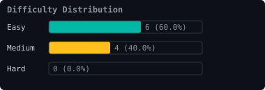
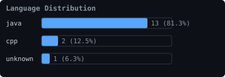
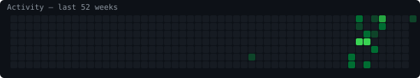

# 🧠 LeetCode Journey

*Automated progress tracker powered by [CodeStreak](https://github.com/AdarshShinde0608/CodeStreak)*

---

| 🔥 Current Streak | 🏆 Longest Streak | ✅ Total Solved | 📅 This Year |
|:-----------------:|:-----------------:|:--------------:|:------------:|
| **1 days** | **4 days** | **11** | **11** |

> **Today's Status:** ✅ GOAL MET

---

## 📊 Difficulty Breakdown

| Difficulty | Count | Percentage |
|:----------:|:-----:|:----------:|
| 🟢 Easy    | 7 | 63.6% |
| 🟡 Medium  | 4 | 36.4% |
| 🔴 Hard    | 0 | 0.0% |

---

## 🌐 Languages

| Language | Problems | % |
|:--------:|:--------:|:-:|
| Java | 10 | 90.9% |
| C++ | 1 | 9.1% |

---

## 🗂️ Top Topics

| Topic | Problems |
|:-----:|:--------:|
| Two Pointers | 8 |
| Linked List | 7 |
| Hash Table | 4 |
| Floyd's Cycle Finding Algorithm | 4 |
| Array | 3 |
| Math | 2 |
| Recursion | 2 |
| Sorting | 1 |
| Binary Search | 1 |
| Bit Manipulation | 1 |

---

## 🔥 Streak Details

| Metric | Value |
|:------:|:-----:|
| Current Streak | **1 days** |
| Longest Streak | **4 days** |
| Total Active Days | **9** |
| Streak Since | 2026-08-18 |
| Last Solved | 2026-08-18 |

---

## 🕐 Recent Submissions

| # | Problem | Difficulty | Language | Date |
|:-:|:-------:|:----------:|:--------:|:----:|
| 234 | [Palindrome Linked List](https://leetcode.com/problems/palindrome-linked-list/) | 🟢 Easy | Java | 2026-08-18 |
| 2 | [Add Two Numbers](https://leetcode.com/problems/add-two-numbers/) | 🟡 Medium | Java | 2026-08-15 |
| 2 | [Add Two Numbers](https://leetcode.com/problems/add-two-numbers/) | 🟡 Medium | Java | 2026-08-15 |
| 2 | [Add Two Numbers](https://leetcode.com/problems/add-two-numbers/) | 🟡 Medium | Java | 2026-08-15 |
| 1 | [Two Sum](https://leetcode.com/problems/two-sum/) | 🟢 Easy | Java | 2026-08-15 |
| 1 | [Two Sum](https://leetcode.com/problems/two-sum/) | 🟢 Easy | Java | 2026-08-15 |
| 1 | [Two Sum](https://leetcode.com/problems/two-sum/) | 🟢 Easy | Java | 2026-08-14 |
| 1 | [Two Sum](https://leetcode.com/problems/two-sum/) | 🟢 Easy | Java | 2026-08-14 |
| 2095 | [Delete the Middle Node of a Linked List](https://leetcode.com/problems/delete-the-middle-node-of-a-linked-list/) | 🟡 Medium | Java | 2026-08-08 |
| 2095 | [Delete the Middle Node of a Linked List](https://leetcode.com/problems/delete-the-middle-node-of-a-linked-list/) | 🟡 Medium | Java | 2026-08-08 |

---

## 🏆 Achievements

| Achievement | Status | Date |
|:-----------:|:------:|:----:|
| 🎯 First Problem | ✅ Unlocked | 2026-08-18 |
| 🏆 10 Problems | ✅ Unlocked | 2026-08-18 |
| 🏆 25 Problems | 🔒 Locked | — |
| 🏆 50 Problems | 🔒 Locked | — |
| 🏆 100 Problems | 🔒 Locked | — |
| 🏆 250 Problems | 🔒 Locked | — |
| 🏆 500 Problems | 🔒 Locked | — |
| 🏆 1000 Problems | 🔒 Locked | — |
| 🔥 Week Warrior | 🔒 Locked | — |
| 🔥 Month Master | 🔒 Locked | — |
| 🔥 Century Coder | 🔒 Locked | — |
| 🔥 Year of Code | 🔒 Locked | — |

---

*Auto-generated by [CodeStreak](https://github.com/AdarshShinde0608/CodeStreak) · Last updated: Tue, 18 Aug 2026 17:17:28 GMT*

