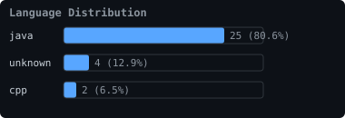
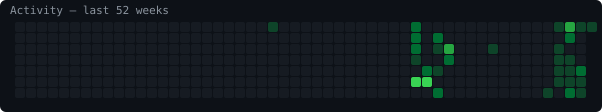

# 🧠 LeetCode Journey

*Automated progress tracker powered by [CodeStreak](https://github.com/AdarshShinde0608/CodeStreak)*

---

| 🔥 Current Streak | 🏆 Longest Streak | ✅ Total Solved | 📅 This Year |
|:-----------------:|:-----------------:|:--------------:|:------------:|
| **4 days** | **5 days** | **32** | **32** |

> **Today's Status:** ✅ GOAL MET

---

## 📊 Difficulty Breakdown

| Difficulty | Count | Percentage |
|:----------:|:-----:|:----------:|
| 🟢 Easy    | 17 | 54.8% |
| 🟡 Medium  | 13 | 41.9% |
| 🔴 Hard    | 1 | 3.2% |

---

## 🌐 Languages

| Language | Problems | % |
|:--------:|:--------:|:-:|
| Java | 30 | 78.9% |
| unknown | 6 | 15.8% |
| C++ | 2 | 5.3% |

---

## 🧩 Platforms

| Platform | Problems |
|:--------:|:--------:|
| leetcode | 31 |
| geeksforgeeks | 1 |

---

## 🗂️ Top Topics

| Topic | Problems |
|:-----:|:--------:|
| Array | 14 |
| Two Pointers | 13 |
| Linked List | 11 |
| Hash Table | 9 |
| Sorting | 5 |
| Math | 5 |
| Sliding Window | 5 |
| String | 5 |
| Floyd's Cycle Finding Algorithm | 4 |
| Binary Search | 4 |

---

## 🔥 Streak Details

| Metric | Value |
|:------:|:-----:|
| Current Streak | **4 days** |
| Longest Streak | **5 days** |
| Total Active Days | **32** |
| Streak Since | 2026-11-20 |
| Last Solved | 2026-11-23 |

---

## 🕐 Recent Submissions

| # | Platform | Problem | Difficulty | Language | Date |
|:-:|:--------:|:-------:|:----------:|:--------:|:----:|
| 242 | leetcode | [Valid Anagram](https://leetcode.com/problems/valid-anagram/) | 🟢 Easy | Java | 2026-11-23 |
| 2124 | leetcode | [Check if All A's Appears Before All B's](https://leetcode.com/problems/check-if-all-as-appears-before-all-bs/) | 🟢 Easy | Java | 2026-11-22 |
| 217 | leetcode | [Contains Duplicate](https://leetcode.com/problems/contains-duplicate/) | 🟢 Easy | Java | 2026-11-21 |
| 90 | leetcode | [Subsets II](https://leetcode.com/problems/subsets-ii/) | 🟡 Medium | unknown | 2026-11-20 |
| 90 | leetcode | [Subsets II](https://leetcode.com/problems/subsets-ii/) | 🟡 Medium | Java | 2026-11-20 |
| 1652 | leetcode | [Defuse the Bomb](https://leetcode.com/problems/defuse-the-bomb/) | 🟢 Easy | Java | 2026-11-16 |
| 643 | leetcode | [Maximum Average Subarray I](https://leetcode.com/problems/maximum-average-subarray-i/) | 🟢 Easy | Java | 2026-11-15 |
| 643 | leetcode | [Maximum Average Subarray I](https://leetcode.com/problems/maximum-average-subarray-i/) | 🟢 Easy | unknown | 2026-11-15 |
| 14 | leetcode | [Longest Common Prefix](https://leetcode.com/problems/longest-common-prefix/) | 🟢 Easy | Java | 2026-11-14 |
| 1979 | leetcode | [Find Greatest Common Divisor of Array](https://leetcode.com/problems/find-greatest-common-divisor-of-array/) | 🟢 Easy | Java | 2026-11-13 |

---

## 🏆 Achievements

| Achievement | Status | Date |
|:-----------:|:------:|:----:|
| 🎯 First Problem | ✅ Unlocked | 2026-11-23 |
| 🏆 10 Problems | ✅ Unlocked | 2026-11-23 |
| 🏆 25 Problems | ✅ Unlocked | 2026-11-23 |
| 🏆 50 Problems | 🔒 Locked | — |
| 🏆 100 Problems | 🔒 Locked | — |
| 🏆 250 Problems | 🔒 Locked | — |
| 🏆 500 Problems | 🔒 Locked | — |
| 🏆 1000 Problems | 🔒 Locked | — |
| 🔥 Week Warrior | 🔒 Locked | — |
| 🔥 Month Master | 🔒 Locked | — |
| 🔥 Century Coder | 🔒 Locked | — |
| 🔥 Year of Code | 🔒 Locked | — |

---

*Auto-generated by [CodeStreak](https://github.com/AdarshShinde0608/CodeStreak) · Last updated: Mon, 23 Nov 2026 17:25:23 GMT*

